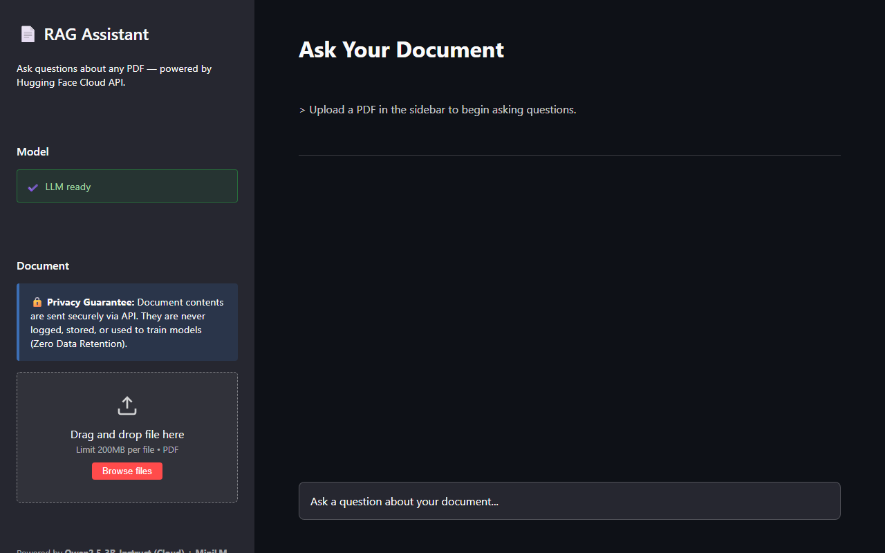
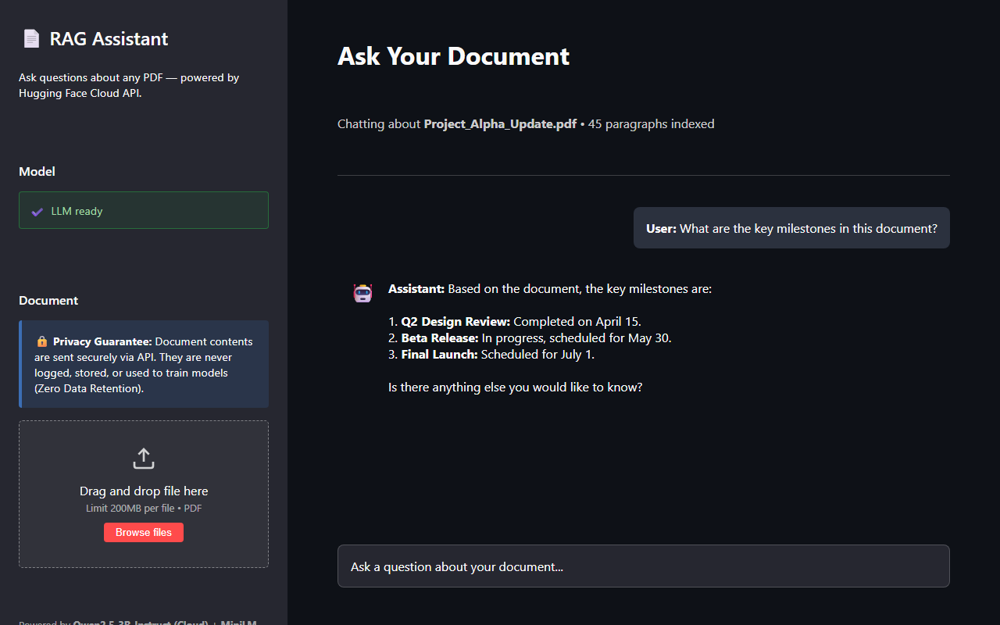
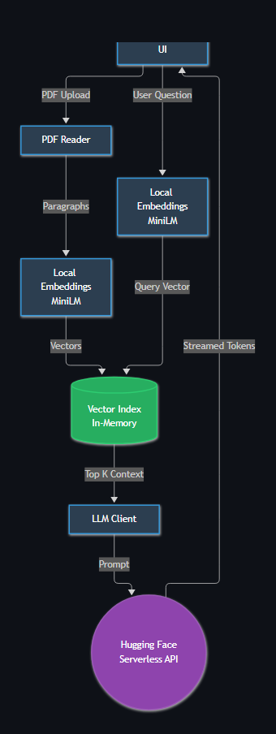

# RAG AI System — Hybrid Cloud-Local Architecture

> A Retrieval-Augmented Generation (RAG) pipeline with a Streamlit chat UI — upload any PDF, ask questions in plain English, and get grounded, streamed answers. Uses local embeddings for speed and privacy, paired with Hugging Face's Cloud API for blazing-fast inference without needing a GPU!

[](https://www.python.org/)
[](https://streamlit.io/)
[](https://huggingface.co/)
[](https://huggingface.co/Qwen/Qwen2.5-3B-Instruct)

---

## What Is This?

RAG AI System is a hybrid Retrieval-Augmented Generation pipeline that lets you upload a PDF and ask natural-language questions against it — with the answer streamed token-by-token directly to your browser.

By adopting a hybrid approach, we get the best of both worlds:
1. **Local Embeddings:** A MiniLM embedding model converts your document into semantic vectors and searches them using a pure-Python in-memory index on your local machine.
2. **Cloud Inference:** Instead of downloading 7GB of weights and struggling with CUDA/GPU issues, the lightweight `llm_client.py` uses Hugging Face's Serverless API to generate answers instantly.

| File | Responsibility |
|---|---|
| `main.py` | Streamlit UI — chat interface, file upload, streaming output |
| `llm_client.py` | `AiModel` — connects to Hugging Face Inference API, streams token output |
| `local_embedding.py` | `LocalEmbedding` — MiniLM wrapper and vector index interface |
| `vector_index.py` | `VectorIndex` — pure-stdlib in-memory cosine/Euclidean vector store |
| `pdf_reader.py` | `PdfReader` — PDF text extraction and paragraph splitting |

---

## Screenshots

### Upload screen — Ready State

The interface highlights the new Privacy Guarantee and the connection to the Hugging Face Cloud API.

### Active conversation

The assistant streams answers retrieved from the local embedding index, powered by the cloud LLM.

### Architecture


---

## Feature List

### Retrieval-Augmented Generation
- PDF ingestion with automatic paragraph extraction and whitespace normalisation
- Batch embedding of all paragraphs in a single pass locally
- Cosine similarity search over 384-dimensional MiniLM vectors
- Configurable top-k retrieval to pass the most relevant context chunks to the LLM
- Strict grounding prompt — the model is instructed to answer only from the provided document text

### Cloud-Powered Streaming Output
- Uses `huggingface_hub.InferenceClient` for fast, serverless inference.
- Tokens are yielded directly from the API without blocking the Streamlit main thread.
- `st.write_stream()` renders tokens progressively as they arrive in the browser.

### Pure-Python Vector Store
- `VectorIndex` uses no NumPy, FAISS, or external vector database
- Vectors are L2-normalised at index time; similarity search reduces to a dot-product scan over stored vectors

---

## How It Works

1. **PDF → Paragraphs** — `PdfReader` reads every page, normalises whitespace, and splits on paragraph breaks.
2. **Paragraphs → Vectors** — `LocalEmbedding.build_index()` batch-embeds all paragraphs using a local `all-MiniLM-L6-v2` model.
3. **Question → Context** — at query time the question is embedded locally and compared against every stored vector by cosine distance; the top-k highest-scoring chunks are retrieved.
4. **Context + Question → Answer** — `AiModel` wraps the context and question in a strict RAG prompt and fires it off to the **Hugging Face Cloud API**, streaming the result back to your screen.

---

## Architecture

```
┌──────────────────────────────────────────────────────────┐
│                    Streamlit UI (main.py)                 │
│                                                           │
│  Sidebar: [Load Model]  [Upload PDF]  [Status]           │
│  Main:    [Chat input]  →  [Streamed answer]             │
└─────────────────────────┬────────────────────────────────┘
                          │
            ┌─────────────▼──────────────┐
            │        PDF Ingestion        │
            │  PdfReader: page text →     │
            │  clean paragraph list       │
            └─────────────┬──────────────┘
                          │
            ┌─────────────▼──────────────┐
            │       LocalEmbedding        │
            │  all-MiniLM-L6-v2 (LOCAL)  │
            │  batch embed → 384-dim     │
            │  L2-normalised vectors      │
            └─────────────┬──────────────┘
                          │
            ┌─────────────▼──────────────┐
            │        VectorIndex          │
            │  in-memory cosine store     │
            │  (pure Python stdlib)       │
            └─────────────┬──────────────┘
                          │ top-k chunks
            ┌─────────────▼──────────────┐
            │       AiModel (Client)      │
            │  HF Serverless API (CLOUD) │
            │  Sends RAG prompt over HTTP │
            └─────────────┬──────────────┘
                          │ token stream
            ┌─────────────▼──────────────┐
            │      st.write_stream()      │
            │  → live tokens in browser   │
            └─────────────────────────────┘
```

---

## Installation

### Prerequisites

| Requirement | Notes |
|---|---|
| Python 3.10+ | Earlier versions not tested |
| Hugging Face account | **Required** for the `.env` `HF_TOKEN` to use the free cloud API |

### Setup

```bash
# Clone the repository
git clone https://github.com/Mohamad-Hachem/RAG_AI_SYSTEM.git
cd RAG_AI_SYSTEM

# Create and activate a virtual environment
python -m venv .venv
source .venv/Scripts/activate   # Windows (Git Bash)
# source .venv/bin/activate     # macOS / Linux

# Install dependencies (no heavy PyTorch + CUDA required for the LLM anymore!)
pip install transformers streamlit pypdf python-dotenv huggingface_hub torch
```

### Add your Hugging Face token

Create a `.env` file in the project root:

```
HF_TOKEN=hf_your_token_here
```

Get a free token at [huggingface.co/settings/tokens](https://huggingface.co/settings/tokens). This is strictly required to query the cloud models.

---

## Usage

```bash
streamlit run main.py
```

Streamlit will print a local URL (default `http://localhost:8501`). Open it in your browser.

### Basic workflow

1. Wait for **"LLM ready"** in the sidebar.
2. Drag and drop any PDF onto the uploader, or click **Browse**.
3. Wait for **"Document ready — N paragraphs indexed"** in the sidebar.
4. Type your question in the chat input at the bottom and press Enter.
5. The answer streams token-by-token. Ask follow-up questions freely — the index is cached.
6. Upload a new PDF to start a fresh conversation.

---

## Limitations

- **Cloud Data Transfer & Privacy** — Your PDF text chunks leave your machine to be processed by the Hugging Face API. However, we rely on **Zero Data Retention (ZDR)** API policies, meaning your data is encrypted in transit (HTTPS), processed in memory, and instantly deleted without being stored or used for training.
- **Single document at a time** — the index holds one PDF; there is no multi-document or cross-document Q&A.
- **API Rate Limits** — Since we rely on Hugging Face's free tier, you may encounter rate-limiting if you ask too many questions rapidly.
- **In-memory index only** — `VectorIndex` is not persisted to disk; re-uploading the same PDF re-embeds it from scratch on every run.
